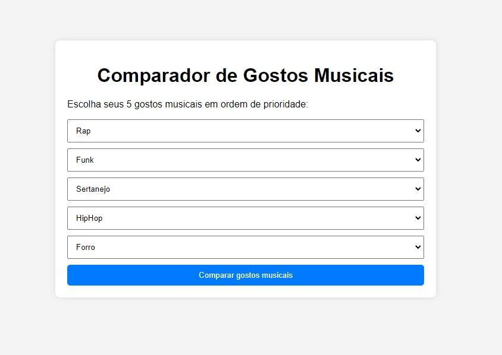
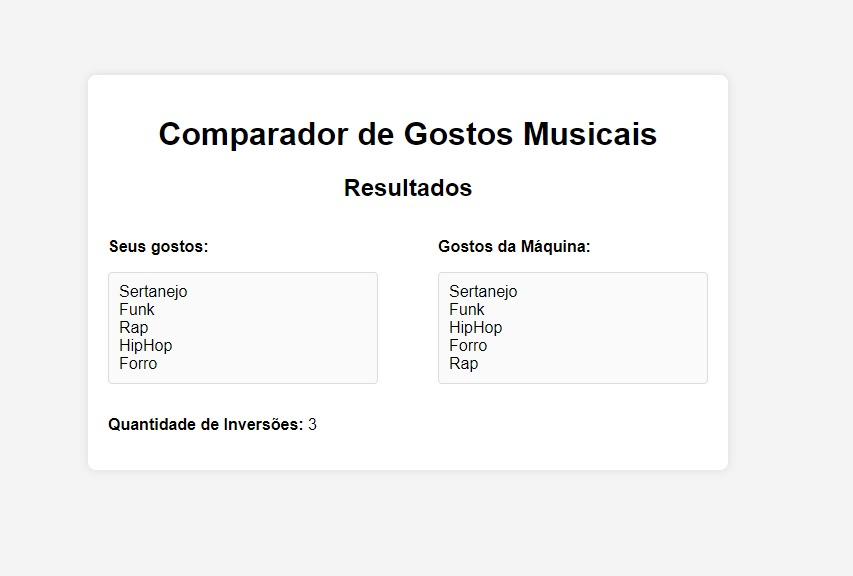

# Contando Inversões

**Conteúdo da Disciplina**: Dividir e Conquistar<br>

## Alunos
|Matrícula | Aluno |
| -- | -- |
| 20/0061216  |  Cleber de Oliveira Brant |
| 20/0044559  |  Wesley Lira Carvalho |

## Sobre 
O projeto consiste em mostrar 5 gêneros musicais na qual o usuário vai rankear da 1° até o 5° gênero de cima a baixo, e o algoritmo vai rankear o Top 5 gêneros músicais dele. No fim, ele irá te mostrar quantas inversões possui relacionado ao rankeamento que o algoritmo escolheu. O objetivo é mostrar o quanto o seu gosto musical é parecido com o do algoritmo.

## Screenshots
Menu seleção gostos musicais


Resultado comparação musical


## Instalação 
**Linguagem**: HTML, CSS e Javascript<br>

## Uso 

Com o projeto aberto, acesse o terminal e vá até onde o projeto está salvo. Após isso, digite o seguinte comando:

```
    npm install -g http-server
```

O comando acima permite que possa subir localmente o projeto em sua máquina. Após ter instalado o http-server, no mesmo terminal e na raiz do projeto insira o seguinte comando: http-server. Uma outra forma de subir localmente o projeto é instalando a extensão Live Server caso esteja pelo Visual Studio Code.

Após subir o projeto, rankeie os gêneros músicais aonde o primeiro gênero da lista é considerada como o gênero musical que você mais agora, e o 5° gênero como o que você menos gosta. Após rankear o seu gosto, clique no botão e aguarde o resultado.

## Outros 
[Video.](https://www.youtube.com/watch?v=GwTabiNQYxo)